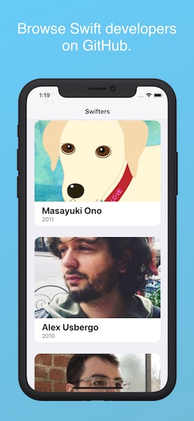

# Swifters

The Swifters iOS app lets you browse [Swift](https://swift.org/) users on [GitHub](https://github.com). Its purpose is to explore [GraphQL](https://graphql.org) with [Apollo iOS](https://www.apollographql.com/docs/ios/), a strongly-typed, caching GraphQL client. Swifters queries GitHub’s [GraphQL API v4](https://developer.github.com/v4/). If your new to GraphQL, you might want to read my [introduction](https://troubled.pro/2019/02/graphql.html).

The Swifters iOS app lets you browse [Swift](https://swift.org/) users on [GitHub](https://github.com). Its purpose is to explore [GraphQL](https://graphql.org) with [Apollo iOS](https://www.apollographql.com/docs/ios/), a strongly-typed, caching GraphQL client. Swifters queries GitHub’s [GraphQL API v4](https://developer.github.com/v4/).

 

Swifters progressively populates its [cache](https://www.apollographql.com/docs/ios/watching-queries.html), while users scroll a list of Swift developers on GitHub, loading two to three handfuls of Swifters at a time. Tapping a developer in the list shows details.

## Objectives

- Explore GraphQL building a modern application with Apollo and [UICollectionView](https://developer.apple.com/documentation/uikit/uicollectionview)
- Compare the imperative and procedural REST approach to the declarative GraphQL
- Paginate with [UICollectionViewDataSourcePrefetching](https://developer.apple.com/documentation/uikit/uicollectionviewdatasourceprefetching)

## Dependencies

- 💫 [Apollo](https://github.com/apollographql/apollo-ios) – A strongly-typed, caching GraphQL client
- 🖼 [Nuke](https://github.com/kean/Nuke) – Image loading and caching
- 🔗 [Ola](https://github.com/michaelnisi/ola) – Check reachability of host
- 🦀 [DeepDiff](https://github.com/onmyway133/DeepDiff) – Amazingly incredible extraordinary lightning fast diffing

## Installation

Swifters needs a personal access token to communicate with [GitHub’s GraphQL server](https://developer.github.com/v4/guides/forming-calls/#authenticating-with-graphql).

These scopes are required:

- `read:user`
- `user:email`

### Building with your token

```
$ GITHUB_TOKEN=<token> make
```

#### What this does

- Clone repositories of framework dependencies into `./deps`
- Download the GitHub API schema to `./Swifters/schema.json`
- Install your token in `./Swifters/config.json` for runtime access
- Build the Swifters Xcode scheme (for validation)

#### Expected output

Unless you have selected a team, the last step will fail, but leave you set for running the app in a simulator. If you plan to run Swifters on a decice, just select a development team in the project editor of the Swifters target for signing.

#### Manual Code Generation

```
$ ${HOME}/node/apollo-tooling/packages/apollo/bin/run client:codegen --target=swift .
````

### Running the app

```
$ open Swifters.xcworkspace
```

- Select Swifters scheme
- Run ⌘R 🙌

### Node.js

The code generation build step uses [Apollo CLI](https://github.com/apollographql/apollo-tooling), thus Xcode needs access to the Node toolchain for the build to succeed. If you’re having issues with Xcode not finding Node, try:

```
ln -s $(which node) /usr/local/bin/node
```

You might have to do the same for npm and npx.

## License

[MIT License](https://github.com/michaelnisi/swifters/blob/master/LICENSE)
